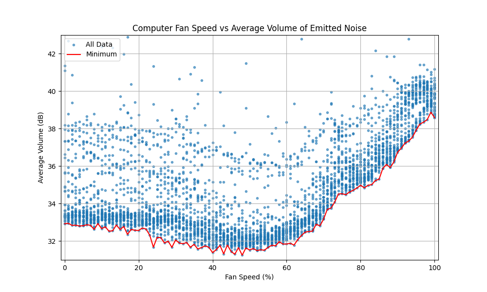
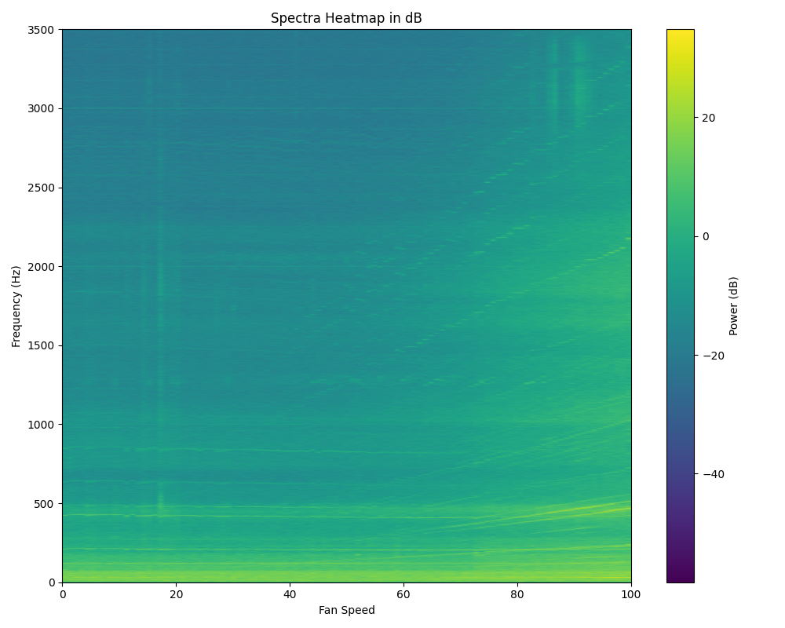

# ME 105 Fan Speed Experiment

This project explores the relationship between computer fan speed, noise volume, and the spectral distribution of emitted noise. The goal is to analyze how changes in fan speed affect noise levels and identify dominant frequencies and trends.

## Overview

### Key Objectives:
- Measure and analyze noise volume across a range of fan speeds.
- Investigate the spectral distribution of noise to identify frequency patterns.

### Key Findings:
1. **Volume Trends:** Noise volume increases roughly linearly above 60% fan speed, with a notable lip around 70–75%.
2. **Spectral Insights:** Higher fan speeds amplify higher frequencies disproportionately, with streaks indicating blade rotation harmonics.

## Results

### Volume Averages:
The scatter plot below shows the relationship between fan speed and average noise volume, highlighting trends and variability across the data. Audio was recorded as 5-second clips to mitigate the effects of ambient and environment noise. Loud interruptions become outlier data points for individual recordings, preserving the remaining data. The minimum average volume at each fan speed is taken to be representative of cooling fan noise, as the recorded volume cannot be quieter than the fan noise alone. As such, greater average volume is taken to be a result of environment noise.

During light computer use, I'd been keeping my cooling fan speeds around 65% because I had noticed a significant increase in audible noise for higher fan speeds. In line with personal experience, the above figure shows a notable lip at rougly 70-75% fan speed. 

It also turns out there is one motherboard fan that is not subject to control by my software. It ramps up upon detecting an increase in temperature and its effects are visible below 50% fan speed. Cooling power from the main fans decreases, causing the small fan to ramp up. As a result, average volume levels are greater at set fan speeds of 0% than ambient, and even greater than at 50%. 

### Spectral Data:
The heatmap below visualizes the spectral distribution of noise, with fan speed on the x-axis and frequency on the y-axis. Color intensity represents sound volume in decibels. Note the many diagonal lines visible primarily above 40% fan speed. These reflect the effect of fan blade frequency increasing linearly with fan speed. It seems multiple harmonics are present as well.

### Potential Improvements:
Potential improvements to this experiment include finding a way to disable the small, independent motherboard fan. In addition taking average spectral data of representative recordings could yield a clearer final spectrogram.